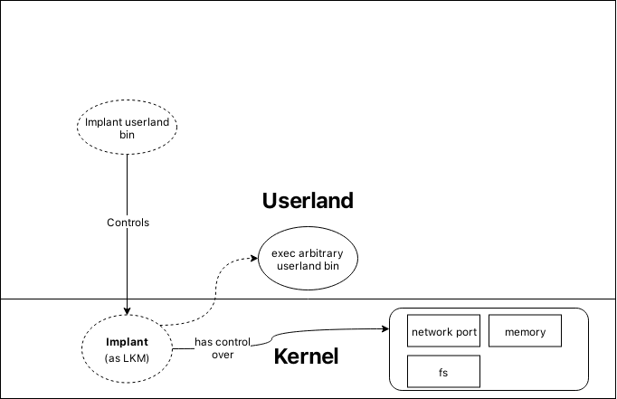

Project Brief
=============

"This next president is going to inherit the most sophisticated and persistent
cyber espionage cultures the world has ever seen, he needs to surround himself
with experts that can expedite the allocation of potent layers of next
generation defences around our targeted critical infrastructure silos." --
**James Scott, Institute for Critical Infrastructure Technology**

Inspired by recent developments in international politics and diplomacy, this
project proposes a software implant for Linux-based operating systems. An
implant is a computer program designed to provide persistent privileged access
to a computer system and often, it is a requirement that the implant hide its
own existence from the owners of that system.

Implants are widely used and developed with notable ones including `Stuxnet
<https://www.symantec.com/security-center/writeup/2010-071400-3123-99>`_ and
`Double Pulsar
<https://www.symantec.com/security-center/writeup/2017-042122-0603-99>`_.
Stuxnet was a toolchain written by the United States’s National Security Agency
(NSA), who are responsible for the nation’s signal intelligence and disruptive
operations. The toolchain was used to provide intelligence and modify the
behaviour of the industrial control systems powering Iran’s nuclear program.
Double Pulsar was an implant tool developed by the same agency. The tool runs in
`privileged mode <https://wiki.osdev.org/Security>`_ on a computer’s processor
and provides an API for starting processes, killing processes, and for beaconing
back to a command and control station. These tools are low-level and must be
made custom for the systems they are targeting support for, relying heavily on
specialised engineers and researchers.

This project proposal introduces a tool in the same vein as Stuxnet and Double
Pulsar, called **sc-implant**. The tool will be an implant for the Linux-based
operating system, `Debian Buster <https://wiki.debian.org/DebianBuster>`_, and
will reside in the privileged component of the system — the kernel. Acting as a
`loadable linux kernel module
<https://en.wikipedia.org/wiki/Loadable_kernel_module#Linux>`_, sc-implant, will
provide an API allowing for the privilege escalation of unprivileged processes,
the hiding of file system state, and persistent privileged and remote access.
The challenge of this project, and of all implants, is how these features can be
provided without being detected. Further, because kernel implants operate
inside the kernel, bugs are especially punishing and cannot be easily recovered
from. Special emphasis during development must be placed on ensuring that there
are as few bugs as possible.

Implants alone can be used as single products. However, when deploying large
numbers of them it becomes difficult to manage and maintain them. In real-world
scenarios, implants are commonly used along with `command and control
<https://attack.mitre.org/tactics/TA0011/>`_ (C2) programs. C2 programs are used
to manage instances of implants by facilitating the user to send commands to
multiple implants at once. Another useful feature of this class of program is
that often they present implant status information in an easy to use and
informative way. Consequently, implants and C2 programs are inseparable. A
stretch goal for the project is to provide a basic C2 program to demonstrate the
capabilities of the project.
